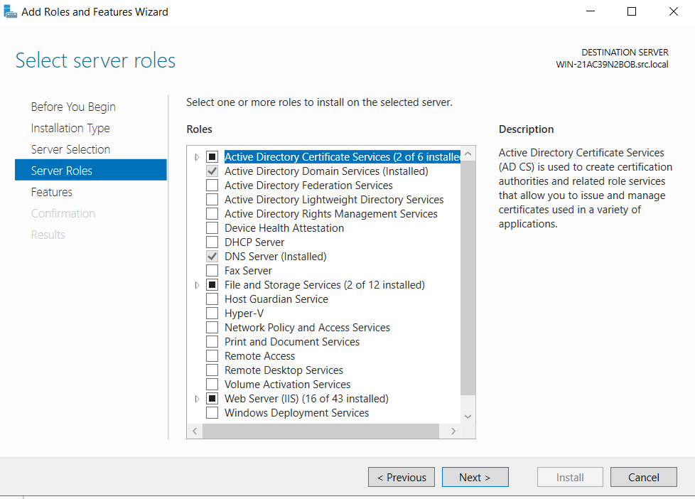
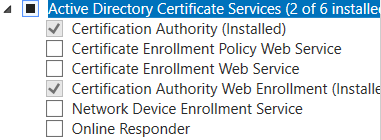

# S-RCS Quraşdırma Təlimatı / Installation Guide

> 📘 **For English version**, scroll down to [English Section](#english-installation-guide)

---

# 🇦🇿 Azərbaycan Dilində Təlimat

## 📋 Mündəricat
1. [Giriş](#giriş)
2. [Tələblər](#tələblər)
3. [Proyekti Yükləmək](#proyekti-yükləmək)
4. [Active Directory Hazırlığı](#active-directory-hazırlığı)
5. [.env Konfiqurasiyası](#env-konfiqurasiyası)
6. [Docker Quraşdırması](#docker-quraşdırması)
7. [Container-ları Başlatmaq](#container-ları-başlatmaq)
8. [Installer Sehrbazı](#installer-sehrbazı)
9. [Quraşdırmadan Sonra - İstifadəçi/Qrup İdarəetməsi](#quraşdırmadan-sonra)
10. [Problemlərin Həlli](#problemlərin-həlli)

---

## Giriş

**S-RCS** (Server Reporting and Controlling System) Windows Active Directory idarəetmə portalıdır. Bu təlimat sizi sıfırdan ətraflı şəkildə quraşdırma prosesinə aparacaq.

### Sistem Arxitekturası
```
┌─────────────────────────────────────────────────────────────┐
│                    S-RCS Server (Docker)                     │
│  ┌─────────────┐  ┌──────────────┐  ┌───────────────────┐   │
│  │ PHP/Apache  │  │    MySQL     │  │    phpMyAdmin     │   │
│  └─────────────┘  └──────────────┘  └───────────────────┘   │
└─────────────────────────────────────────────────────────────┘
                           │
                           │ LDAPS (Port 636)
                           ▼
┌─────────────────────────────────────────────────────────────┐
│              Windows Server (Domain Controller)              │
│  ┌─────────────┐  ┌──────────────┐  ┌───────────────────┐   │
│  │Active       │  │ Certificate  │  │   Users, Groups   │   │
│  │Directory DS │  │  Services    │  │   OUs, Computers  │   │
│  └─────────────┘  └──────────────┘  └───────────────────┘   │
└─────────────────────────────────────────────────────────────┘
```

---

## Tələblər

### S-RCS Server Tələbləri
| Komponent | Minimum | Tövsiyə Olunan |
|-----------|---------|----------------|
| RAM | 2 GB | 4 GB |
| CPU | 2 Core | 4 Core |
| Disk | 10 GB | 20 GB |
| OS | Windows 10/11, Ubuntu 20.04+, macOS | Ubuntu 22.04 LTS |

### Windows Server (Domain Controller) Tələbləri
- Windows Server 2016, 2019, 2022 və ya 2025
- **Active Directory Domain Services** rolu quraşdırılmış
- **Active Directory Certificate Services** rolu quraşdırılmış
- **Port 636 (LDAPS)** açıq olmalıdır

---

## Proyekti Yükləmək

### Git ilə (Tövsiyə Olunur)

```bash
git clone https://github.com/Ali7Zeynalli/S-RCS.git
cd S-RCS
```

### ZIP olaraq

1. [GitHub Səhifəsinə](https://github.com/Ali7Zeynalli/S-RCS) keçin
2. Yaşıl **Code** düyməsinə basın
3. **Download ZIP** seçin
4. ZIP faylını çıxarın və qovluğa daxil olun

---

## Active Directory Hazırlığı

> ⚠️ **Vacib**: Bu addımlar Domain Controller-da icra edilməlidir!

### Addım 1: Certificate Services Rolunun Quraşdırılması

1. **Server Manager** açın
2. **Manage → Add Roles and Features** seçin
3. **Role-based installation** seçin
4. Server seçin və **Next** basın
5. **Active Directory Certificate Services** işarələyin



6. Alt rollardan aşağıdakıları seçin:
   - ✅ **Certification Authority**
   - ✅ **Certification Authority Web Enrollment**
7. Quraşdırmanı tamamlayın

### Addım 2: Certificate Authority Konfiqurasiyası

1. Server Manager-da sarı xəbərdarlıq görəcəksiniz
2. **Configure Active Directory Certificate Services** linkinə basın
3. Credentials təsdiq edin (Domain Admin hesabı)
4. **Certification Authority** və **CA Web Enrollment** seçin:



5. **Enterprise CA** seçin
6. **Root CA** seçin
7. **Create a new private key** seçin
8. Default kriptoqrafik parametrləri saxlayın
9. CA adını təyin edin (məsələn: `DOMAIN-CA`)
10. Validity period: 5 il (default)
11. Quraşdırmanı tamamlayın

### Addım 3: LDAPS Yoxlanması

> 🔐 **Port 636 (LDAPS)** nədir?
> 
> LDAPS = LDAP over **SSL/TLS** - təhlükəsiz şifrələnmiş bağlantıdır.
> - **Port 389** = Şifrəsiz LDAP (təhlükəli, istifadə etməyin!)
> - **Port 636** = SSL ilə qorunan LDAPS (təhlükəsiz ✅)
> 
> S-RCS yalnız **Port 636** ilə işləyir çünki şifrələr və həssas məlumatlar ötürülür.

PowerShell-də:
```powershell
# LDAPS portunu yoxlayın
Test-NetConnection -ComputerName localhost -Port 636

# Nəticə: TcpTestSucceeded : True olmalıdır
```


### Addım 4: Firewall Konfiqurasiyası

> ⚠️ **Əgər `TcpTestSucceeded : False` görürsünüzsə**, port bağlıdır və açılmalıdır!

#### Metod 1: PowerShell ilə (Tövsiyə Olunur)

```powershell
# Port 636-nı açın
New-NetFirewallRule -Name "LDAPS" -DisplayName "LDAPS (636)" -Protocol TCP -LocalPort 636 -Action Allow -Direction Inbound

# Yoxlayın ki, rule yaradıldı
Get-NetFirewallRule -Name "LDAPS"
```

#### Metod 2: Windows Firewall UI ilə

1. **Windows Defender Firewall with Advanced Security** açın:
   - `Win + R` basın → `wf.msc` yazın → Enter
2. Sol paneldən **Inbound Rules** seçin
3. Sağ paneldən **New Rule...** basın
4. **Rule Type**: `Port` seçin → Next
5. **Protocol and Ports**: `TCP`, **Specific local ports**: `636` → Next
6. **Action**: `Allow the connection` → Next
7. **Profile**: Bütün profillər işarələnsin → Next
8. **Name**: `LDAPS (636)` → Finish

#### Yoxlama

```powershell
Test-NetConnection -ComputerName localhost -Port 636
# İndi TcpTestSucceeded : True olmalıdır
```

---

## .env Konfiqurasiyası

Proyekt qovluğunda `.env` faylını açın və şifrələri dəyişdirin:

```bash
# MySQL Database Settings
MYSQL_ROOT_PASSWORD=GucluSifre123!     # 🔴 Dəyişdirin!
MYSQL_DATABASE=ldap_auth               # Saxlaya bilərsiniz
MYSQL_USER=srcs_admin                  # Saxlaya bilərsiniz
MYSQL_PASSWORD=SifrenizBuraya!         # 🔴 Dəyişdirin!

# MySQL Port
MYSQL_PORT=3306

# Web Server Ports
HTTP_PORT=8080                         # Lazım olsa dəyişdirin
HTTPS_PORT=8043                        # Lazım olsa dəyişdirin

# phpMyAdmin Port
PMA_PORT=8081
```

> ⚠️ **Vacib**: Default şifrələri mütləq dəyişdirin!

---

## Docker Quraşdırması

> 💡 Əgər Docker artıq quraşdırılıbsa, [Container-ları Başlatmaq](#container-ları-başlatmaq) bölməsinə keçin.

### Windows 10/11 Desktop

1. [Docker Desktop](https://www.docker.com/products/docker-desktop) yükləyin
2. Quraşdırın və restart edin
3. Docker Desktop-u açın
4. Settings → General → "Use the WSL 2 based engine" aktiv edin
5. Yoxlama:
   ```powershell
   docker --version
   docker-compose --version
   ```

### Ubuntu / Debian Linux

```bash
# Docker quraşdırması
sudo apt update
sudo apt install -y docker.io docker-compose

# İstifadəçini docker qrupuna əlavə edin
sudo usermod -aG docker $USER

# Yenidən daxil olun (logout/login)
exit
```

### macOS

1. [Docker Desktop for Mac](https://www.docker.com/products/docker-desktop) yükləyin
2. `.dmg` faylını açın və Applications-a sürükləyin
3. Docker Desktop-u başladın
4. Terminal-da yoxlayın:
   ```bash
   docker --version
   docker-compose --version
   ```

### Windows Server 2019/2022

PowerShell (Administrator):
```powershell
# Containers feature quraşdırın
Install-WindowsFeature -Name Containers

# Docker quraşdırın
Install-Module -Name DockerMsftProvider -Force
Install-Package -Name docker -ProviderName DockerMsftProvider -Force

# Restart
Restart-Computer

# Yoxlama
docker version
```

---

## Container-ları Başlatmaq

Proyekt qovluğunda:

```bash
# Build və start
docker-compose up -d --build

# Statusu yoxlayın
docker-compose ps
```

**Gözlənilən nəticə:**
```
NAME          STATUS
mysql-db      Up
php-apache    Up
php-myadmin   Up
```

### MySQL-in Hazır Olmasını Gözləyin

MySQL ilk dəfə başlayanda database initialize edir (1-2 dəqiqə):

```bash
docker-compose logs -f mysql
# "ready for connections" görənə qədər gözləyin
```

---

## Installer Sehrbazı

### Veb Installerə Daxil Olun

Brauzerdə açın:
- **HTTPS**: `https://localhost:8043`
- **HTTP**: `http://localhost:8080`

> 💡 **Hansı ünvanı istifadə edim?**
> 
> | Docker harada işləyir? | İstifadə ediləcək ünvan |
> |------------------------|-------------------------|
> | Öz kompüterinizdə | `localhost` və ya `127.0.0.1` |
> | Başqa serverdə (Windows/Linux) | Serverin IP adresi, məsələn: `192.168.1.50` |
 
> **Nümunə**: Docker `192.168.1.100` IP-li Ubuntu serverdə işləyirsə → `https://192.168.1.100:8043`

### Addım 1: System Requirements

Installer avtomatik yoxlayacaq:
- ✅ PHP Version (7.4+)
- ✅ LDAP Extension
- ✅ PDO Extension
- ✅ MySQL Extension
- ✅ OpenSSL Extension
- ✅ Config Directory (Writable)
- ✅ Memory Limit (128M+)

### Addım 2: Domain Settings

| Sahə | Açıqlama | Nümunə |
|------|----------|--------|
| Domain Controller IP | DC-nin IP adresi | `192.168.1.10` |
| Domain Name | Domain adı | `company.local` |
| LDAPS Port | 636 (default) | `636` |
| Admin Username | Domain Admin | `administrator` |
| Admin Password | Admin şifrəsi | `****` |
| Admin Group | İdarəetmə qrupu | `Administrators` |

> ⚠️ **Vacib**: **Admin Group** sahəsini düzgün təyin edin! Bu qrupda olan istifadəçilər S-RCS-ə daxil ola biləcək.


### Addım 3: Database Settings

> 📌 Bu sahələr `.env` faylından avtomatik yüklənir və readonly-dir.

### Addım 4: Confirmation

Bütün parametrləri yoxlayın və **Start Installation** basın.

### Addım 5: Installation Complete

Quraşdırma tamamlandıqda:
- **License Key** göstəriləcək (saxlayın!)

### Addım 6: Təhlükəsizlik Kilidi (Security Lock)

Quraşdırma uğurla tamamlandıqdan sonra, sistem installerə icazəsiz girişin qarşısını almaq üçün avtomatik olaraq kilidlənir.


> 🔐 **Təhlükəsizlik Bildirişi**
> 
> Installer artıq kilidlənib. Əgər yenidən `install.php`-ə daxil olmağa çalışsanız, yuxarıdakı "System Locked" ekranını görəcəksiniz.

**Yenidən Quraşdırmaq (Kilidi Açmaq) üçün:**

Əgər quraşdırma sehrbazını yenidən işə salmaq istəyirsinizsə, kilid faylını serverdən əl ilə silməlisiniz:

1. Proyekt qovluğuna daxil olun
2. `www/config/` qovluğuna keçin
3. `.installed` faylını silin

Bu faylı sildikdən sonra installerə yenidən daxil ola bilərsiniz.

---

## Quraşdırmadan Sonra

### İstifadəçi və Qrup İdarəetməsi

S-RCS quraşdırıldıqdan sonra, əlavə istifadəçi və qruplar üçün icazə vermək istəyirsinizsə:

#### Yeni Qruplar Əlavə Etmək

1. S-RCS-ə admin hesabı ilə daxil olun
2. **System Configuration** → **Active Directory Settings** bölməsinə keçin
3. **Allowed Groups** bölməsində yeni qruplar əlavə edin


#### Nümunələr

| Qrup | Məqsəd |
|------|--------|
| `Domain Admins` | Tam icazə - bütün domenin idarəetməsi |
| `Administrators` | Server administratorları |
| `Help Desk` | Dəstək komandası - bilet idarəetməsi |
| `S-RCS Admins` | S-RCS üçün xüsusi yaradılmış qrup |

> 💡 **Qeyd**: Hər bir qrup AD-da mövcud olmalıdır. Yeni qrup yaratmaq üçün **Active Directory Users and Computers** açın.

---

## 🌐 Uzaqdan Giriş - NovusGate VPN

> **S-RCS-ə istənilən yerdən güvənli giriş istəyirsiniz?**

Əgər S-RCS sistemini ofisdən kənarda - evdən, səfərdən və ya başqa şəhərdən idarə etmək istəyirsinizsə, sizə **NovusGate** VPN həllini tövsiyə edirik.

### NovusGate Nədir?

**NovusGate** - WireGuard protokolu əsaslı müasir VPN həllidir ki, şirkət şəbəkəsinə uzaqdan təhlükəsiz qoşulmağa imkan verir.

### Üstünlükləri

| Xüsusiyyət | Təsvir |
|------------|--------|
| 🔐 **Təhlükəsiz Şifrələmə** | WireGuard ilə hərbiyə səviyyəsində şifrələmə |
| ⚡ **Sürətli Bağlantı** | Millisaniyələrlə qoşulma |
| 🌍 **Hər Yerdən Giriş** | S-RCS-ə evdən, kafedən, səfərdən daxil olun |
| 📱 **Cross-Platform** | Windows, Linux, macOS, Android, iOS dəstəyi |

### Ətraflı Məlumat

🔗 **GitHub**: [github.com/Ali7Zeynalli/NovusGate](https://github.com/Ali7Zeynalli/NovusGate)

> 💡 NovusGate quraşdırma dəstəyi üçün bizimlə əlaqə saxlayın.

---

## Problemlərin Həlli

### MySQL Başlamır

**Xəta**: "The designated data directory /var/lib/mysql/ is unusable"

**Həll**:
```bash
docker-compose down
rm -rf mysql/*          # Windows: Remove-Item -Recurse mysql\*
docker-compose up -d --build
```

### LDAPS Bağlantı Xətası

**Xəta**: "Can't contact LDAP server"

**Yoxlayın**:
1. Port 636 açıqdır? `Test-NetConnection DC_IP -Port 636`
2. Certificate Services quraşdırılıb?
3. Firewall icazə verir?
4. İstifadəçi adı və şifrə düzgündür?

### Container Logları

```bash
docker-compose logs           # Bütün loglar
docker-compose logs php-apache   # Yalnız Apache
docker-compose logs mysql        # Yalnız MySQL
```

### Port Konfliktləri

1. `.env` faylında portları dəyişdirin
2. Container-ları yenidən başladın

---

## 🤝 Professional Dəstək / Enterprise Support

> **Quraşdırma çətin gəlir?** Biz sizə kömək edə bilərik!

Əgər bu təlimatda göstərilən addımları özünüz icra edə bilmirsinizsə və ya enterprise səviyyəsində tam dəstək lazımdırsa, bizə müraciət edə bilərsiniz:

### Ödənişli Xidmətlər

| Xidmət | Təsvir |
|--------|--------|
| 🛠️ **Tam Quraşdırma** | S-RCS-in sizin infrastrukturda tam quraşdırılması |
| 🔧 **AD Konfiqurasiyası** | Certificate Services, LDAPS, Firewall konfiqurasiyası |
| 📞 **Texniki Dəstək** | Problem həlli və davamlı dəstək |
| 📚 **Təlim** | Komandanız üçün S-RCS istifadəsi təlimi |

> 💰 **Qiymətləndirmə**: Xidmət haqqı görüləcək işin həcminə və mürəkkəbliyinə əsasən fərdi olaraq hesablanır. Pulsuz konsultasiya üçün bizimlə əlaqə saxlayın.

### Əlaqə

📧 **Email**: Ali.Z.Zeynalli@gmail.com  
💼 **LinkedIn**: [linkedin.com/in/ali7zeynalli](https://linkedin.com/in/ali7zeynalli)  
📱 **Telefon**: +49 152 2209 4631 (whatsapp)

> 💼 Enterprise müştərilər üçün SLA (Service Level Agreement) ilə dəstək mövcuddur.

### 🌍 Dəstək Verilən Dillər

| Dil | Language |
|-----|----------|
| 🇦🇿 Azərbaycan | Azerbaijani |
| 🇬🇧 İngilis | English |
| 🇩🇪 Alman | German |
| 🇷🇺 Rus | Russian |
| 🇹🇷 Türk | Turkish |

---

*© 2025 Ali Zeynalli - S-RCS Installation Guide*