# S-RCS (Server Reporting and Controlling System)

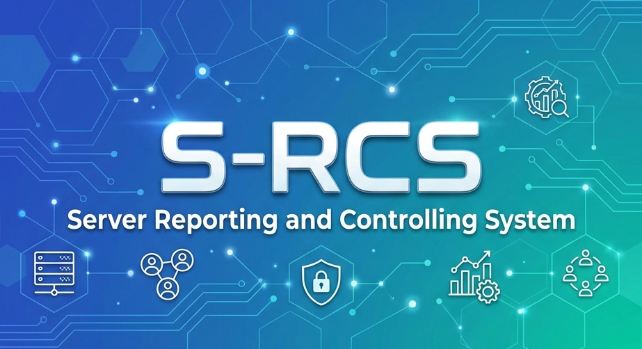

## 🌟 Təqdimat

**S-RCS** (Server Reporting and Controlling System), Windows Active Directory idarəetməsini inqilabi şəkildə dəyişdirmək üçün hazırlanmış, geniş imkanlara malik veb əsaslı bir portaldır. İdarəetməni ənənəvi, çətin interfeyslərdən çıxararaq sadələşdirilmiş və müasir veb platformaya daşıyan S-RCS, vaxt itkisini əhəmiyyətli dərəcədə azaldır və əməliyyat səmərəliliyini artırır.

Sistemin təməlində **sürət və sadəlik** fəlsəfəsi dayanır: demək olar ki, hər bir inzibati tapşırıq — İstifadıçilər (Users), Qruplar (Groups) və Təşkilati Vahidlərin (OU) yaradılmasından tutmuş, mürəkkəb təyinatlara qədər — cəmi **3 kliklə** yerinə yetirilə bilər.

### 🎯 Əsas Məqsədlər
- **Vaxt İtkisini Minimuma Endirmək**: Mürəkkəb menyu naviqasiyası sadələşdirilmiş iş axınları ilə əvəz olunur.
- **"3-Klik" Effektivliyi**: Optimallaşdırılmış İstifadəçi Təcrübəsi (UX) dizaynı tapşırıqların ildırım sürəti ilə icrasını təmin edir.
- **Mərkəzləşdirilmiş İdarəetmə**: İstifadəçi yaradılması, Qrup idarəçiliyi, OU strukturu və yerdəyişmələri (Move) tək bir paneldən idarə edilir.

### 🆕 v1.3.0-da Yeniliklər
> 🎫 **Tapşırıq İdarəetməsi (Helpdesk)** - AD inteqrasiyası, audit loglama və status iş axınları ilə tam İT bilet sistemi. [Dəyişiklik Jurnalına Bax](CHANGELOG_AZ.md)

## 🚀 Əsas Xüsusiyyətlər

*   **🌍 Çoxdilli Dəstək**: Platforma tamamilə çoxdillidir. İnzibatçılar daha rahat işləmək üçün interfeysi istədikləri dilə (məsələn, İngilis, Azərbaycan) keçirə bilərlər.
*   **⚡ Sürətli Quraşdırma**: Docker texnologiyası sayəsində bütün sistem **2 dəqiqədən az** müddətdə işə düşür və istifadəyə hazır olur.
*   **🛡️ Təhlükəsiz və Güclü**: Təhlükəsizlik üzrə ən son standartlara uyğun qurulmuşdur. Active Directory şifrələrinin (credentials) təhlükəsizliyini təmin edir və bütün fəaliyyətlərin ətraflı auditini aparır.

## 📦 Quraşdırma və Tənzimləmə

S-RCS sistemini mühitinizdə işə salmaq üçün aşağıdakı sadə addımları izləyin.

### 1. İlkin Şərtlər (Prerequisites)
- **Docker və Docker Compose** serverdə quraşdırılmalıdır.
- Serverin Active Directory Domain Controller (DC) ilə şəbəkə əlaqəsi olmalıdır.
- **Active Directory Tələbləri ( vacib )**:
    - **🔥 Firewall**: Domain Controller-də **Port 636 (LDAPS)** mütləq **AÇIQ** olmalıdır.
    - **🔐 Sertifikatlar**: **Active Directory Certificate Services** rolu aktiv olmalıdır.
    - **🛠️ Tələb Olunan Rollar (Roles)**: DC-də aşağıdakı rollar quraşdırılmış olmalıdır:
        - **Certification Authority** (Sertifikat Mərkəzi)
        - **Certification Authority Web Enrollment**
    - *Qeyd: Bu şərtlər ödənməzsə, təhlükəsiz LDAPS bağlantısı qurula bilməz və sistem işləməyəcək.*

### 2. Mühit Konfiqurasiyası

Quraşdırmadan əvvəl, layihə kökündəki `.env` faylını redaktə edərək mühitinizi konfiqurasiya edin:

```bash
# MySQL Verilənlər Bazası Tənzimləmələri
MYSQL_ROOT_PASSWORD=SizinTəhlükəsizRootŞifrəniz
MYSQL_DATABASE=ldap_auth
MYSQL_USER=srcs_admin
MYSQL_PASSWORD=SizinTəhlükəsizŞifrəniz

# MySQL Portu
MYSQL_PORT=3306

# Veb Server Portları
HTTP_PORT=8080
HTTPS_PORT=8043

# phpMyAdmin Portu
PMA_PORT=8081
```

> [!IMPORTANT]
> **Təhlükəsizlik Xəbərdarlığı**: Quraşdırmadan əvvəl standart şifrələri dəyişdirin!
> - `MYSQL_ROOT_PASSWORD` - MySQL root istifadəçi şifrəsi
> - `MYSQL_PASSWORD` - Tətbiq verilənlər bazası şifrəsi
> - Bu məlumatlar quraşdırma sihirbazında istifadə olunacaq

### 3. İşə Salma (Deployment)

Repozitoriyanı klonlayın və konteynerləri işə salın:

```bash
# Repozitoriyanı klonlayın
git clone https://github.com/Ali7Zeynalli/S-RCS.git
cd S-RCS

# Mühit faylını redaktə edin (VACİB)
# nano .env  VƏ YA  notepad .env

# Konteynerləri qurun və işə salın
docker-compose up -d --build
```

*Sistem avtomatik konfiqurasiya olunacaq və təxminən 2 dəqiqə ərzində hazır olacaq.*

### 4. Giriş Nöqtələri

Quraşdırmadan sonra sistemə aşağıdakı ünvanlardan daxil olun:

| Xidmət | URL | Təsvir |
|--------|-----|--------|
| **S-RCS** | `https://localhost:8043` | Əsas tətbiq (HTTPS) |
| **S-RCS** | `http://localhost:8080` | Əsas tətbiq (HTTP) |
| **phpMyAdmin** | `http://localhost:8081` | Verilənlər bazası idarəetməsi |

> [!NOTE]
> Uzaqdan giriş üçün `localhost`-u server IP-si ilə əvəz edin.

### 5. Vizuallaşdırılmış Quraşdırma Sihirbazı
Konteynerlər işə düşdükdən sonra brauzerinizdə `https://localhost:8043` (və ya təyin etdiyiniz IP/port) ünvanına daxil olun. Sizi qarşılayan quraşdırma sihirbazı (Installation Wizard) aşağıdakı addımlarla kömək edəcək:

| **1. Xoş Gəldiniz və Lisenziya** | **2. Sistem Tələblərinin Yoxlanışı** |
| :---: | :---: |
| 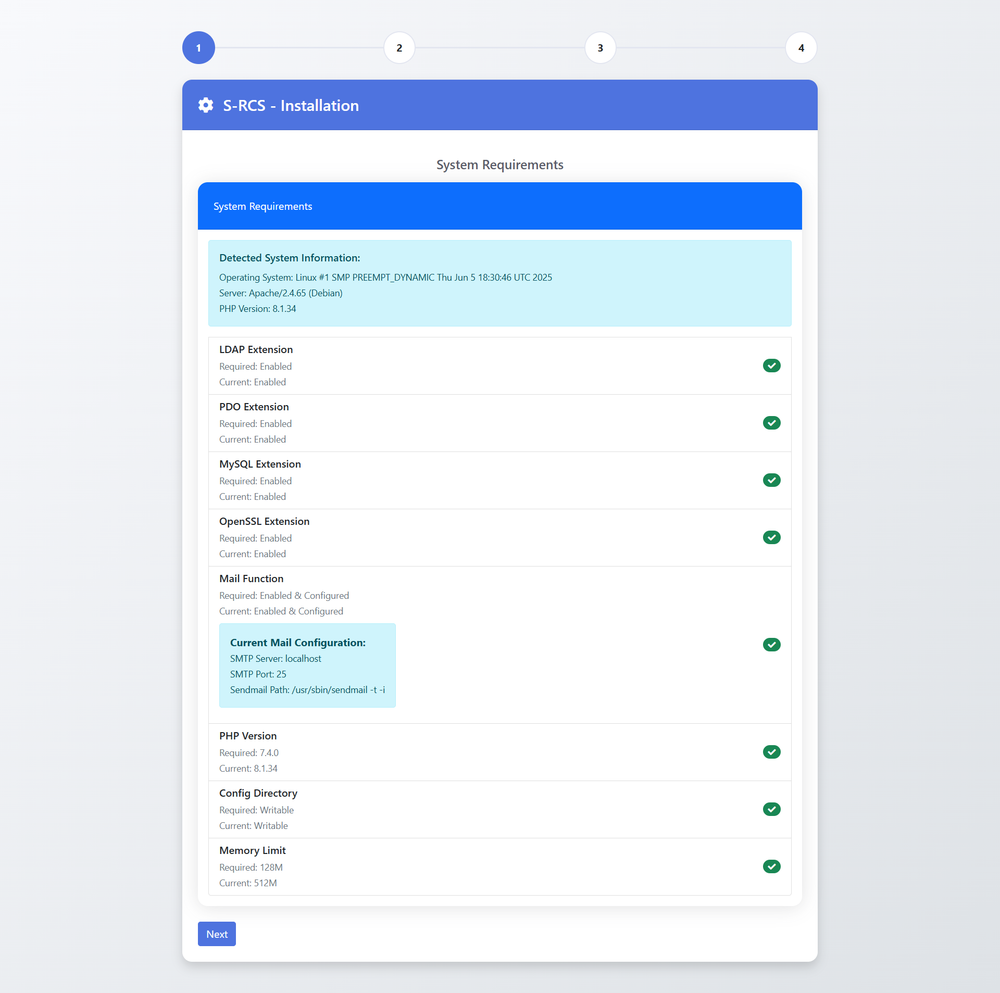 | 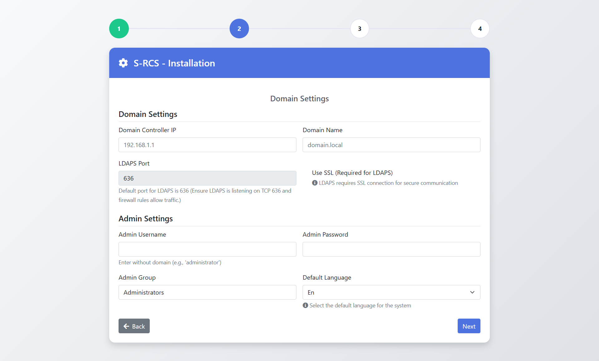 |
| *Şərtləri qəbul edin və başlayın* | *Server mühitinin uyğunluğunu yoxlayır* |

| **3. Verilənlər Bazasının (DB) Tənzimlənməsi** | **4. Administrator Hesabı** |
| :---: | :---: |
| 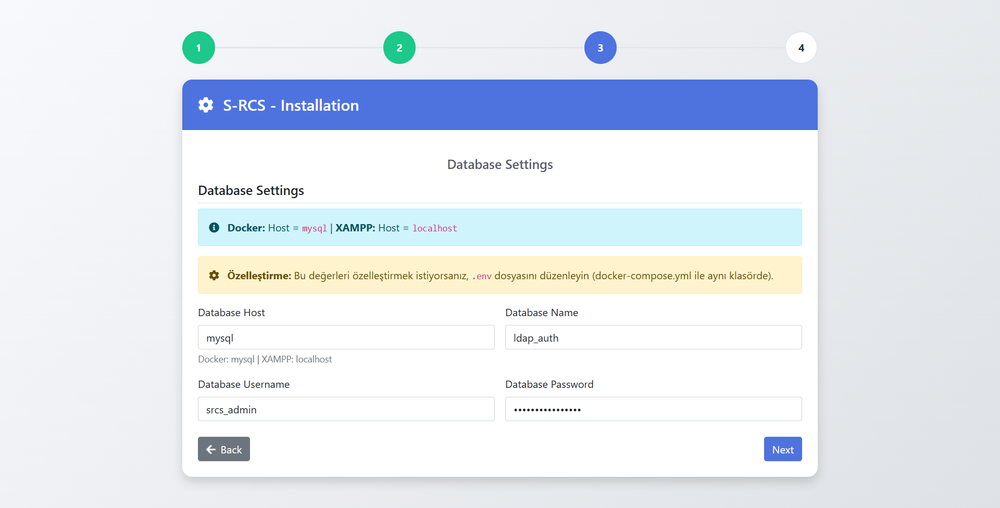 | 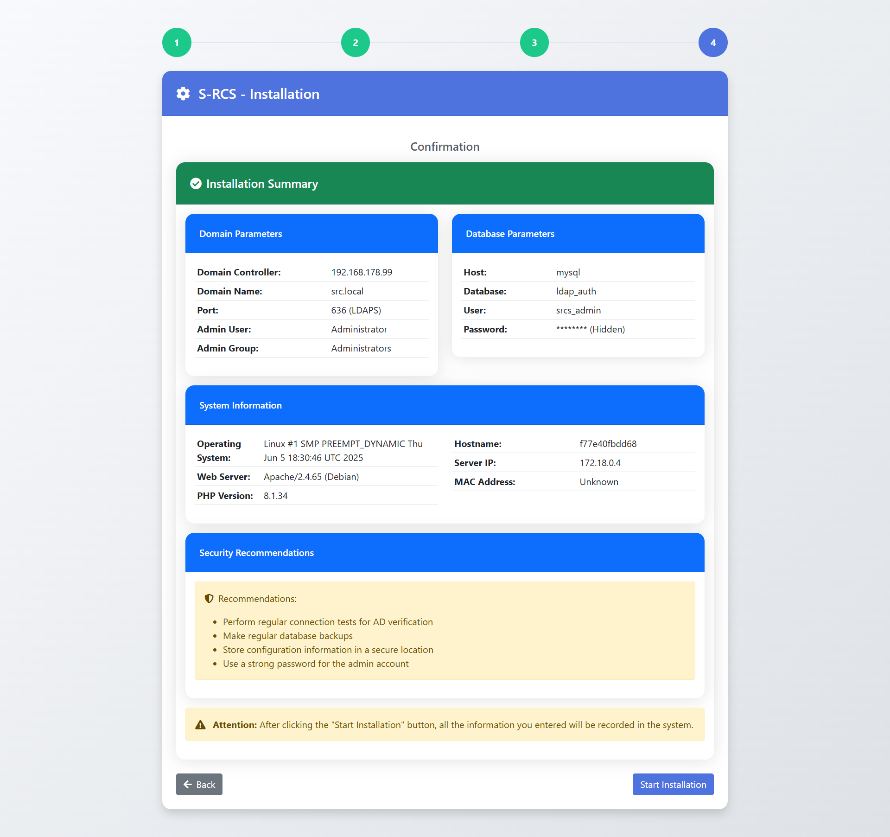 |
| *MySQL bazasına qoşulma* | *Sistem üçün yerli admin yaradın* |

| **5. Active Directory Bağlantısı** | **6. Tamamlanma** |
| :---: | :---: |
| 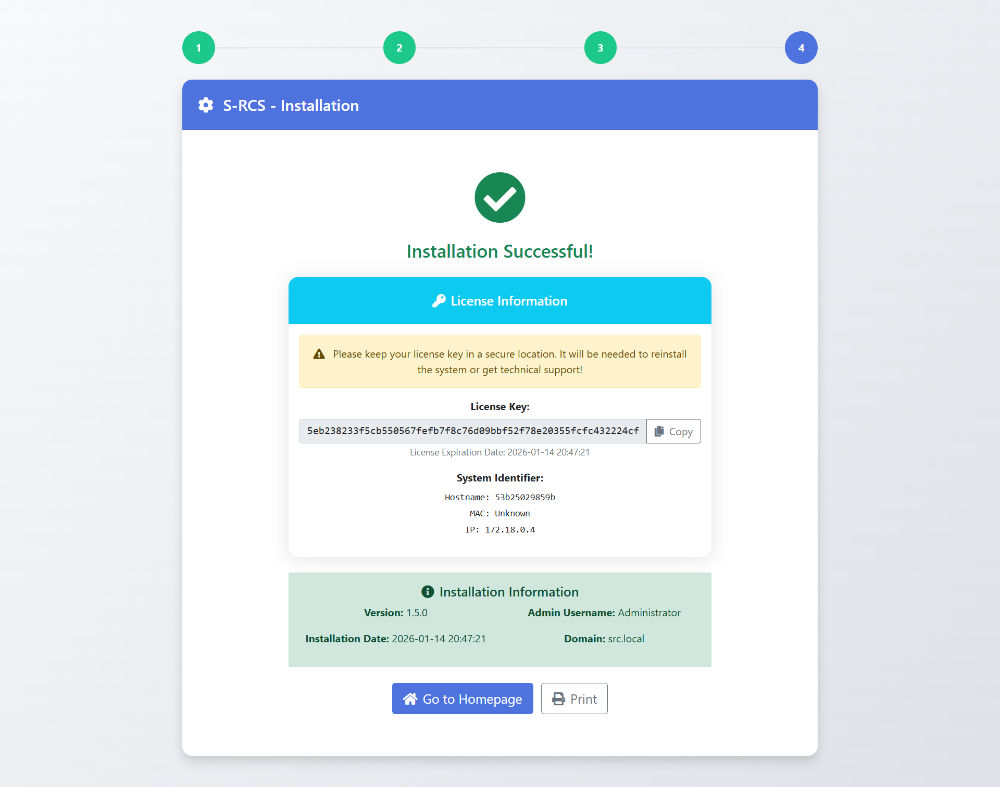 | 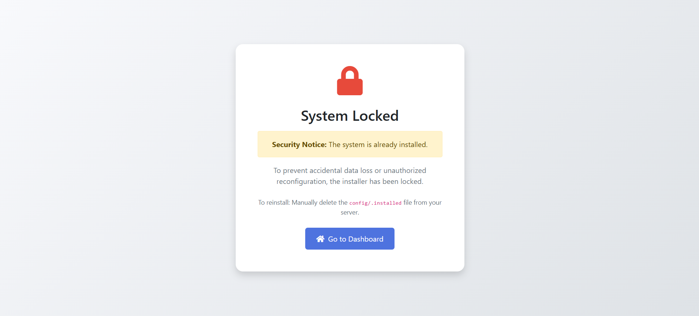 |
| *LDAP əlaqə məlumatları* | *Quraşdırma bitdi!* |

Artıq sisteminiz hazırdır və Active Directory mühitinizi idarə etməyə başlaya bilərsiniz.

## 🔐 Giriş və İdarəetmə Paneli (Dashboard)

### 7. Təhlükəsiz Giriş
Sistemə təhlükəsizlik qaydalarına uyğun (LDAP və ya yerli admin) daxil olun. Giriş ekranı sürətli və təhlükəsiz autentifikasiya üçün dizayn edilib.

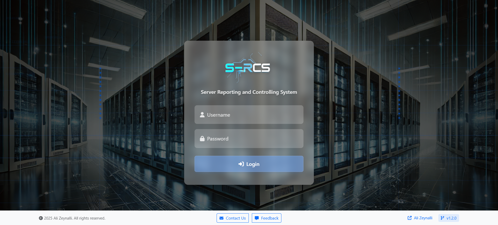

### 8. İnteraktiv İdarəetmə Paneli
Giriş etdikdən sonra sizi bütün modullara birbaşa çıxışı olan və real vaxt statistikasını göstərən geniş İdarəetmə Paneli qarşılayır.

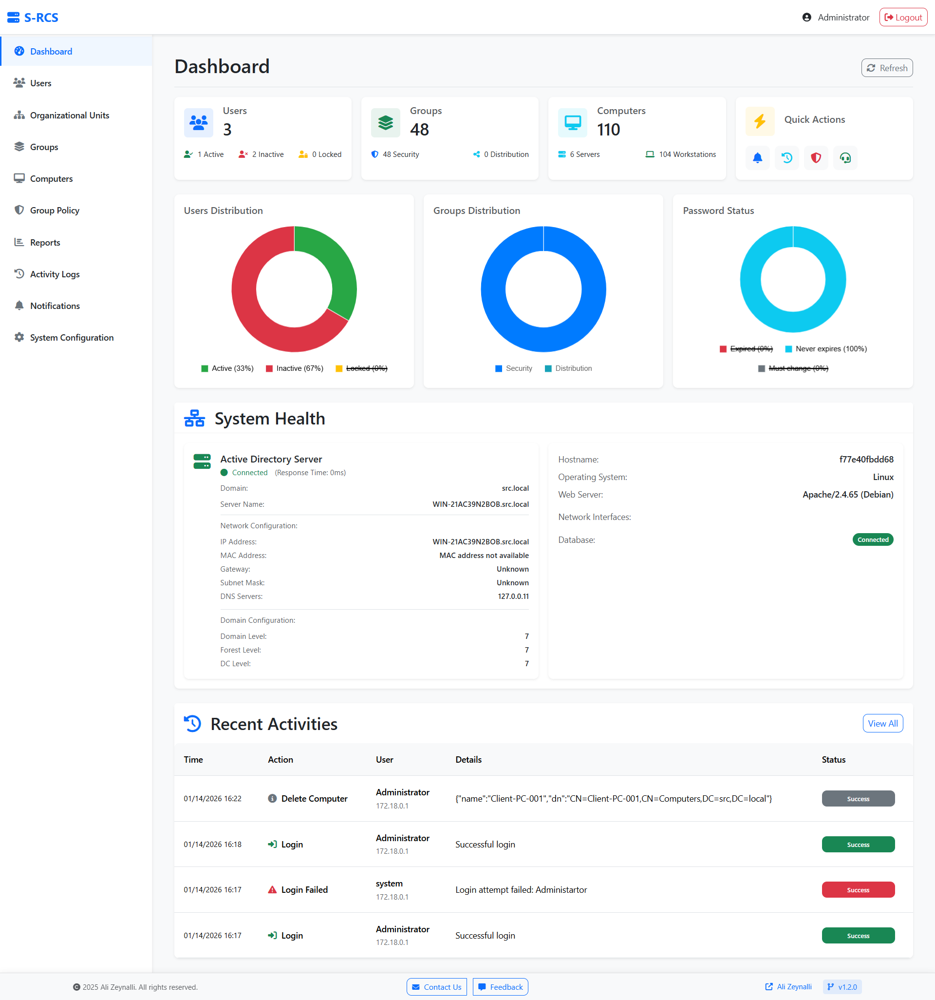

## 👥 İstifadəçi İdarəetməsi (User Management)

S-RCS istifadəçi həyat dövrünü (lifecycle) tam idarə etmək üçün intuitiv və güclü interfeys təqdim edir.

### Ərtajlı İdarəetmə
*   **Yarat və Redaktə Et**: Yeni istifadəçiləri sürətli formalarla yaradın və ya mövcud olanları redaktə edin.
*   **Ətraflı Baxış**: İstifadəçinin bütün atributlarına, əlaqə məlumatlarına və üzv olduğu qruplara baxın.
*   **Qrup Təyinatı**: İstifadəçiləri dərhal Təhlükəsizlik (Security) və ya Paylama (Distribution) qruplarına əlavə edin/çıxarın.
*   **OU İdarəetməsi**: Təşkilati strukturu aydın görün və istifadəçilərin yerini (Move) bir kliklə dəyişin.

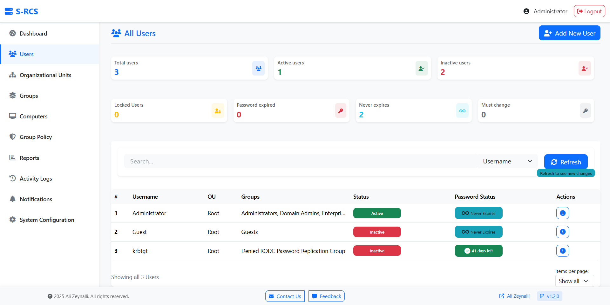

### Təhlükəsizlik Əməliyyatları
Paneldən birbaşa kritik əməliyyatları icra edin:
*   **Şifrə İdarəçiliyi**: Şifrəni sıfırlayın (Reset Password) və ya növbəti girişdə şifrə dəyişimi tələb edin.
*   **Hesab Statusu**: Hesabı dərhal **Bloklayın/Açın (Unlock)** və ya **Aktiv/Deaktiv** edin.
*   **Silmə**: Lazım gəldikdə istifadəçi hesabını təhlükəsiz şəkildə silin.

| **İstifadəçi Detalları** | **Əməliyyat Menyu** |
| :---: | :---: |
| 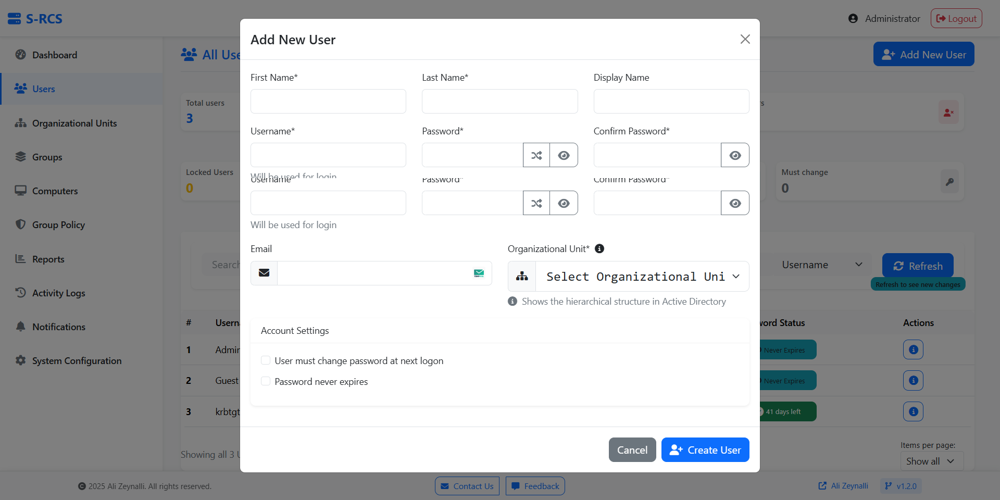 |  |
| *Tam profilə baxış* | *Sürətli inzibati əməliyyatlar* |

## 🏢 Təşkilati Vahid (OU) İdarəetməsi

Active Directory strukturunuzu səliqəli və idarəolunan saxlayın.

### Tam OU Dövrü
*   **OU Yarat**: Yeni şöbə və ya strukturlar üçün dərhal OU yaradın.
*   **Dərin Baxış**: Seçilmiş OU daxilindəki bütün **İstifadəçiləri**, **Qrupları** və **Kompüterləri** görün.
*   **Redaktə və Köçürmə**: OU-ların adını dəyişin və ya onların yerini başqa bir "Parent OU" altına keçirin.

| **OU Yaratma/İdarəetmə** | **Daxili Məzmun** |
| :---: | :---: |
| 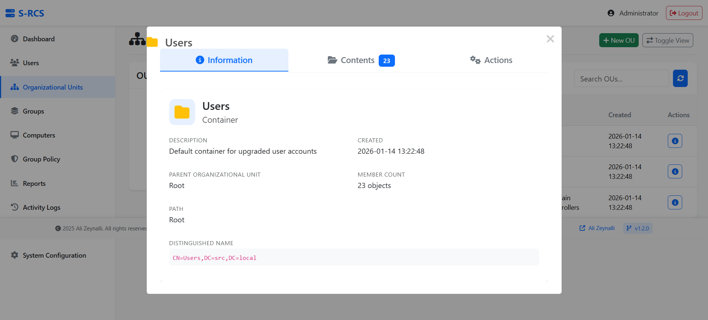 | 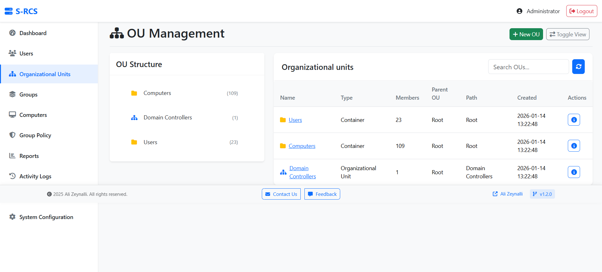 |
| *Yeni OU yaratmaq* | *İstifadəçi və Qruplara baxış* |

| **İyerarxiya** | **Qabaqcıl Əməliyyatlar** |
| :---: | :---: |
|  | 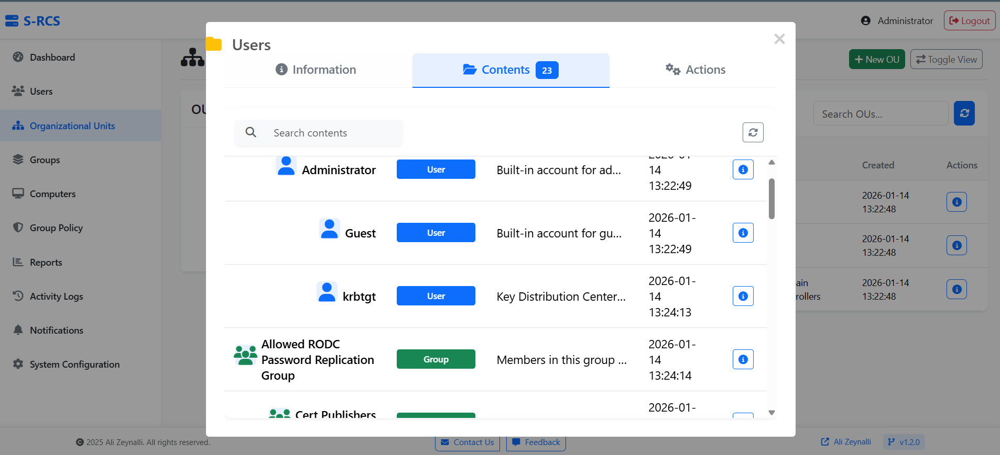 |
| *Ağacvari struktur* | *Redaktə, Köçürmə, Silmə* |

## 👥 Qrup İdarəetməsi (Group Management)

İcazələri və üzvlükləri idarə etmək artıq çox asandır.

### Qrup İnzibatçılığı
*   **Qruplar Yarat**: İstənilən əhatə dairəsində (Scope) **Security** və **Distribution** qrupları yaradın.
*   **Üzvləri İdarə Et**: Qrupa üzvləri axtarışla tapıb əlavə edin və ya siyahıdan çıxarın.
*   **Detallar**: Qrupun üzvlərini, təsvirini və yerləşdiyi OU-nu görün.
*   **Köçürmə**: Qrupları bir OU-dan digərinə asanlıqla daşıyın.

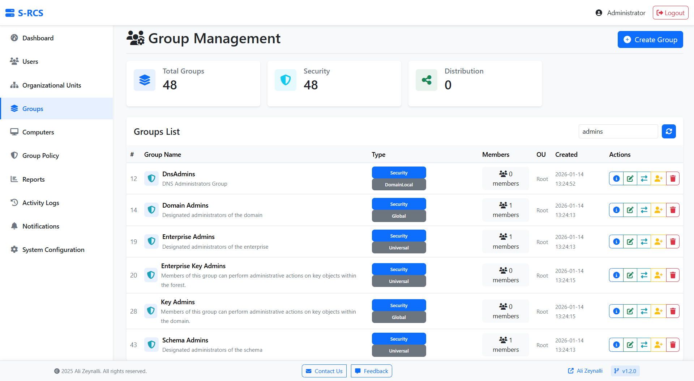

### Üzv Təyinatı
Qrup tərkibini idarə etmək üçün vizual interfeys:
*   **Üzv Əlavə Et**: İntuitiv axtarış funksiyası ilə.
*   **Üzv Sil**: Bir kliklə istifadəçini qrupdan xaric etmək.

| **Qrup Detalları** | **Üzv Əlavə/Sil** |
| :---: | :---: |
| 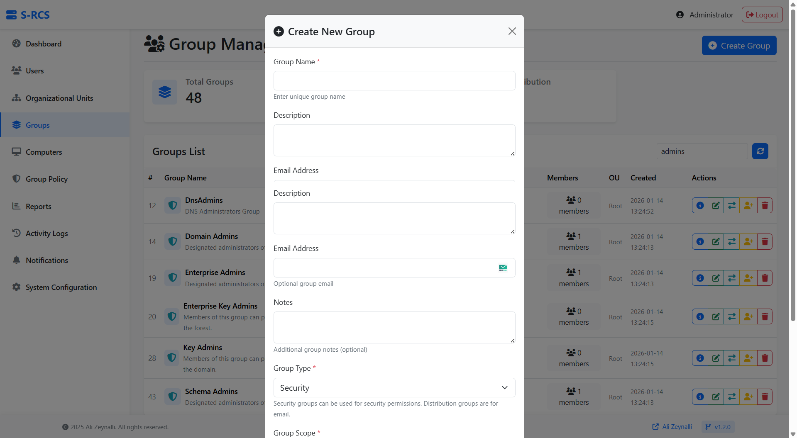 | 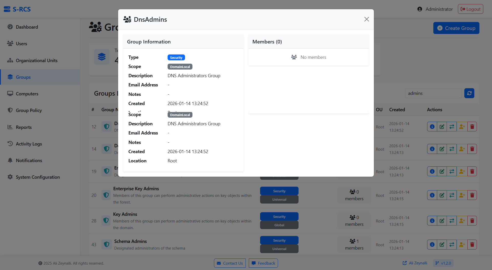 |
| *Tərkibə baxış* | *Giriş hüquqlarını idarə et* |

## 💻 Kompüter İdarəetməsi (Computer Management)

Domainə qoşulmuş cihazlarınızı nəzarətdə saxlayın.

### Cihaz İnzibatçılığı
*   **İnventar Siyahısı**: Domaindəki bütün kompüterlərin siyahısına baxın.
*   **Obyekt İdarəçiliyi**: Kompüter obyektinin detallarına nəzər salın.
*   **OU Yerdəyişməsi**: Fərqli Qrup Siyasətlərini (GPO) tətbiq etmək üçün kompüterləri OU-lar arasında köçürün.

| **Kompüter Siyahısı** | **Kompüter Detalları** |
| :---: | :---: |
|  | 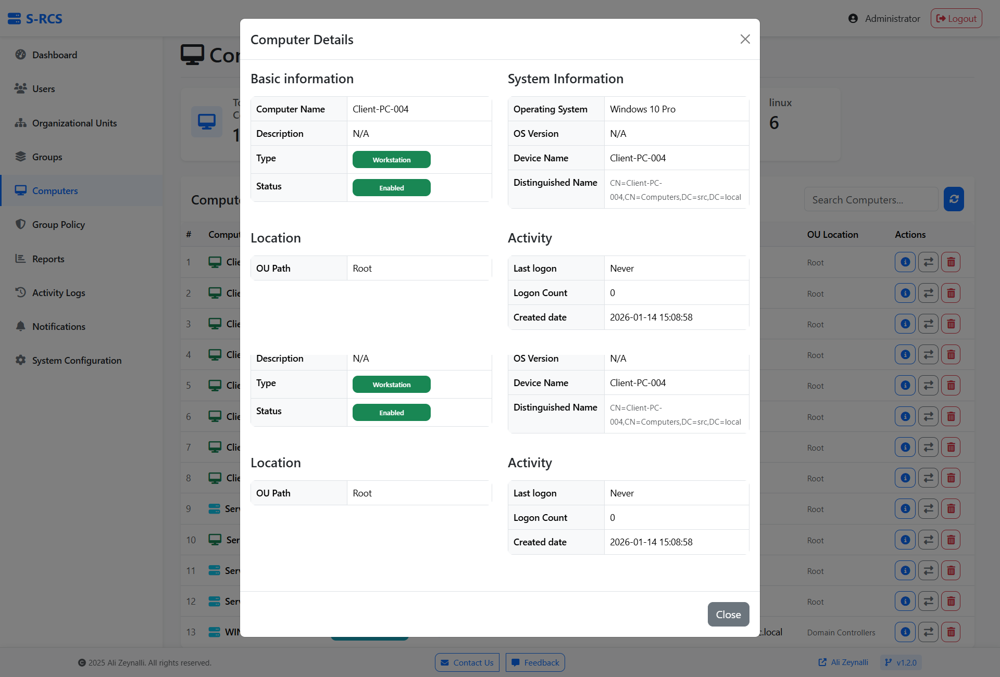 |
| *Bütün cihazlar* | *Detallar və köçürmə* |

## 📜 Qrup Siyasəti (GPO) İdarəetməsi

Təhlükəsizlik və uyğunluq qaydalarına nəzarət edin.

### Siyasət Baxışı
*   **GPO İnventarı**: Mühitinizdəki bütün GPO-ların siyahısı.
*   **Ətraflı Analiz**: Hər bir GPO-nun tənzimləmələrinə, əlaqəli olduğu OU-lara və statusuna baxın.

| **GPO Siyahısı** | **GPO Detalları** |
| :---: | :---: |
| 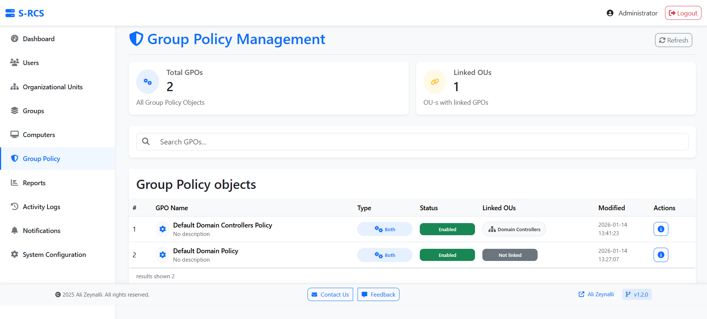 | 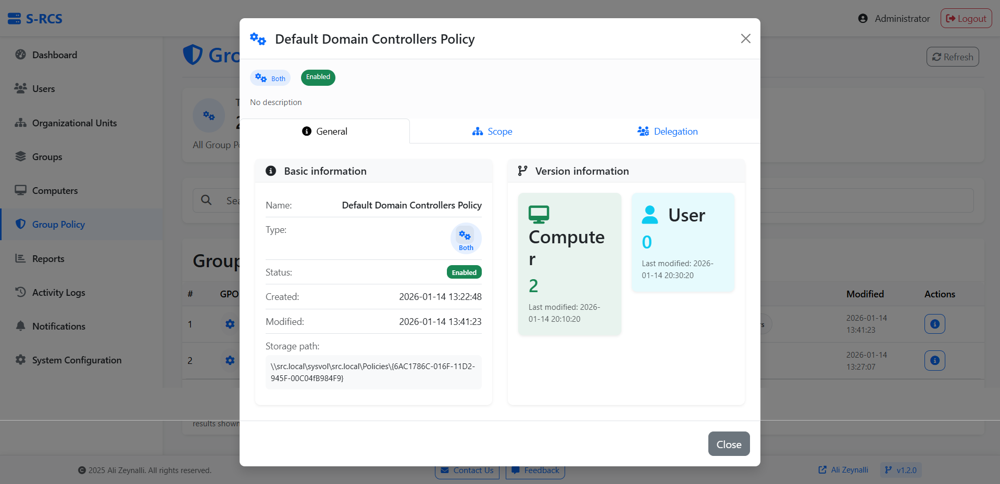 |
| *Bütün siyasətlər* | *Dərin analiz* |

## 🎫 Tapşırıq İdarəetməsi (Helpdesk)

Daxili dəstək sorğularını izləmək, idarə etmək və həll etmək üçün tam inteqrasiya olunmuş İT Helpdesk və bilet sistemi.

### Bilet Həyat Dövrü
*   **Bilet Yarat**: Mövzu, kateqoriya, prioritet və təsirlənən istifadəçi ilə yeni dəstək sorğuları qeyd edin.
*   **Təyin Et və İzlə**: Biletləri administratorlara təyin edin və status yeniləmələri vasitəsilə irəliləyişi izləyin.
*   **Redaktə Et və Sil**: Tam audit izi ilə bilet detallarını dəyişdirin və ya tamamlanmış/yanlış biletləri silin.
*   **Şərhlər və Qeydlər**: Komanda əməkdaşlığı üçün ictimai cavablar və ya daxili qeydlər əlavə edin.

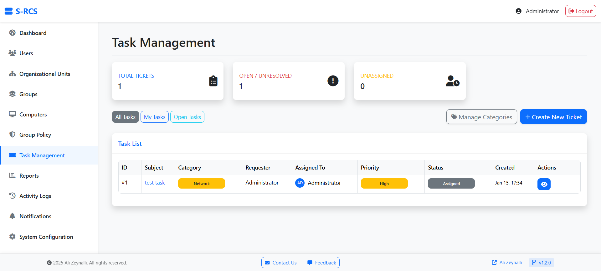

### Əsas Xüsusiyyətlər
*   **Təsirlənən İstifadəçi İnteqrasiyası**: Biletləri birbaşa AD istifadəçilərinə bağlayın.
*   **Kateqoriya İdarəetməsi**: Biletləri fərdiləşdirilə bilən kateqoriyalar (Hardware, Software, Network və s.) üzrə təşkil edin.
*   **Status İş Axını**: Biletləri Yeni → Təyin Edilmiş → Davam Edir → Həll Edildi → Bağlandı olaraq izləyin.
*   **Tam Audit Loglama**: Hər əməliyyat (yaratma, redaktə, silmə, təyin etmə, şərh) Activity Logs-a yazılır.

| **Bilet Yarat** | **Bilet Detalları** |
| :---: | :---: |
| 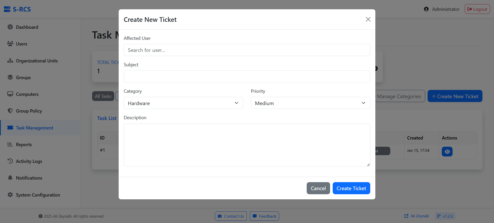 | 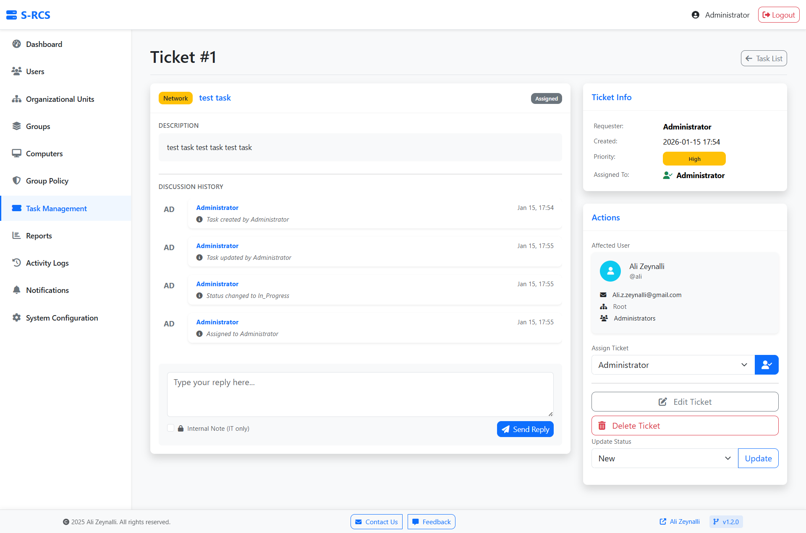 |
| *Yeni dəstək sorğuları qeydə al* | *Tarixçəyə bax və əməliyyatları idarə et* |

## 📊 Hesabatlılıq və Analitika (Reporting)

Məlumatları faydalı hesabatlara çevirin.

### Bir Kliklə İxrac (One-Click Export)
İstənilən resurs növü üçün saniyələr içində dəqiq hesabatlar alın. Audit və inventarizasiya üçün idealdır.
*   **Dəstəklənən Resurslar**: Users, Groups, Computers, OUs, GPOs.
*   **Formatlar**: Məlumatları **Excel (.xlsx)** və ya **CSV** formatında yükləyin.
*   **Səmərəlilik**: Mürəkkəb sorğulara ehtiyac yoxdur, sadəcə klikləyin və yükləyin.

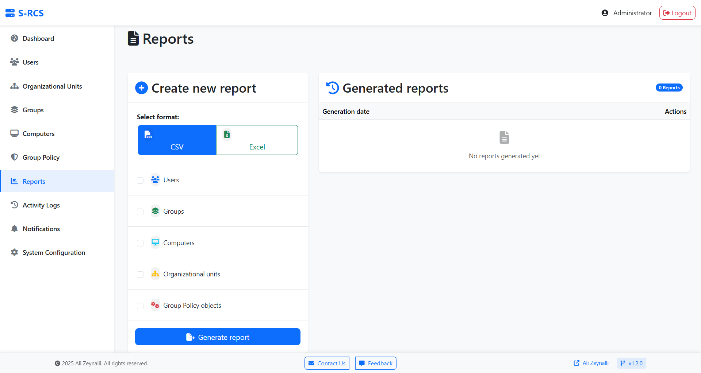

## 📝 Audit Loglama (Audit Logging)

Təşkilatınızda tam şəffaflığı təmin edin.

### Fəaliyyət İzləmə
Portal daxilində edilən hər bir dəyişiklik və inzibati əməliyyat qeydə alınır.
*   **Kim**: Əməliyyatı icra edən administrator.
*   **Nə**: İcra edilən əməliyyatın növü (məs: "User Created").
*   **Nə zaman**: Dəqiq vaxt möhürü.
*   **Detallar**: Əməliyyatın nəticəsi və detalları.

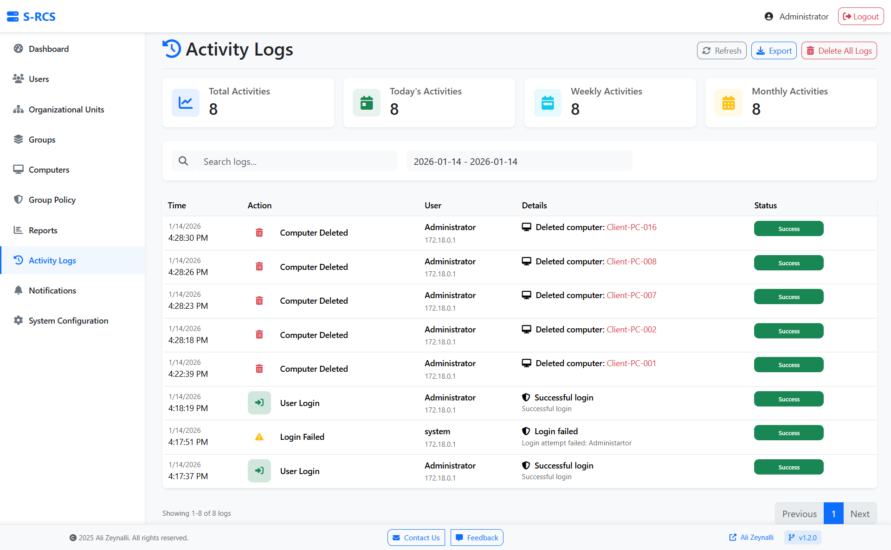

## ⚙️ Sistem Konfiqurasiyası

Mərkəzi idarəetmə panelindən platformanın bütün tənzimləmələrinə nəzarət edin.

### Mərkəzi İdarəetmə
Sistem səviyyəli bütün konfiqurasiyalar buradan idarə olunur:
*   **Ümumi Tənzimləmələr**: Tətbiq seçimləri.
*   **AD Konfiqurasiyası**: Domain Controller və Base DN tənzimləmələri.
*   **Təhlükəsizlik**: Şifrə siyasətləri və giriş qaydaları.
*   **Fərdiləşdirmə**: Dil və interfeys seçimləri.

| **Admin Paneli** | **Ümumi Tənzimləmələr** |
| :---: | :---: |
| 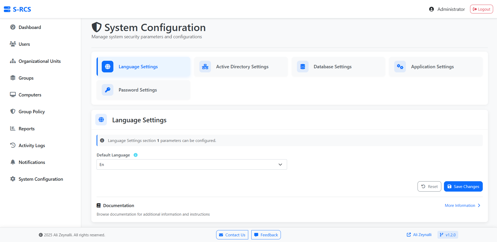 | 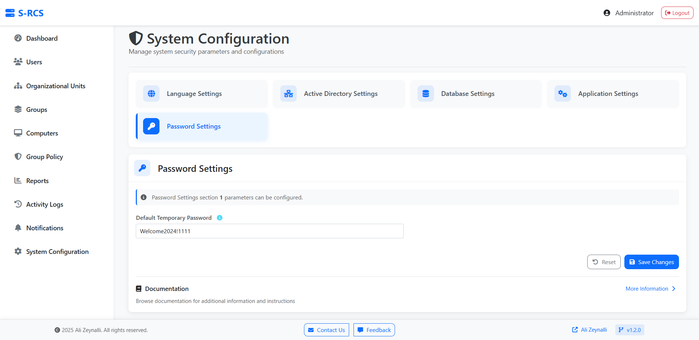 |
| *Mərkəzi idarəetmə* | *Əsas sistem parametrləri* |

| **Qabaqcıl Seçimlər** | **Mühit Tənzimləmələri** | **Təhlükəsizlik** |
| :---: | :---: | :---: |
| 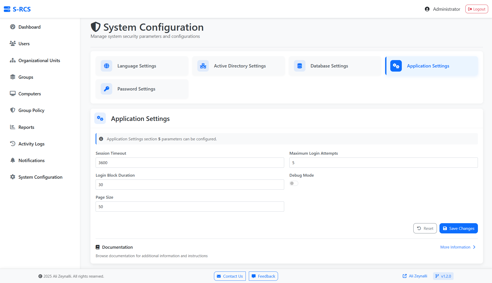 | 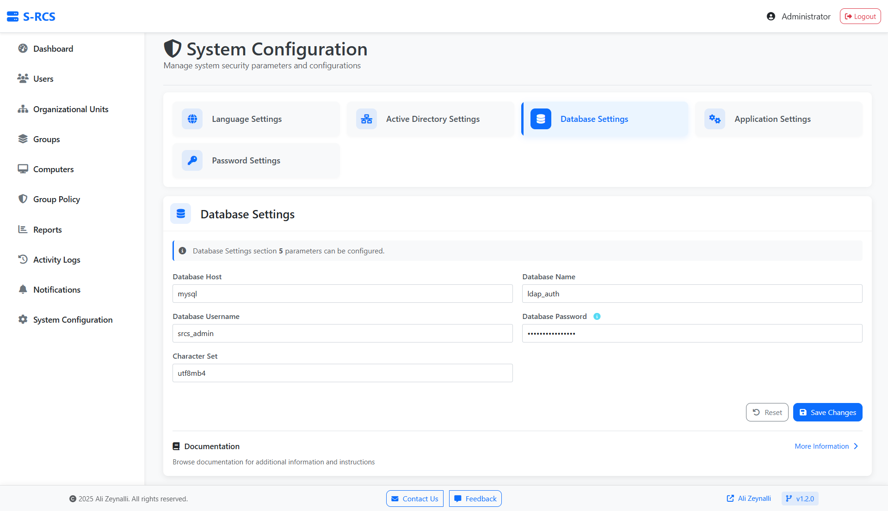 | 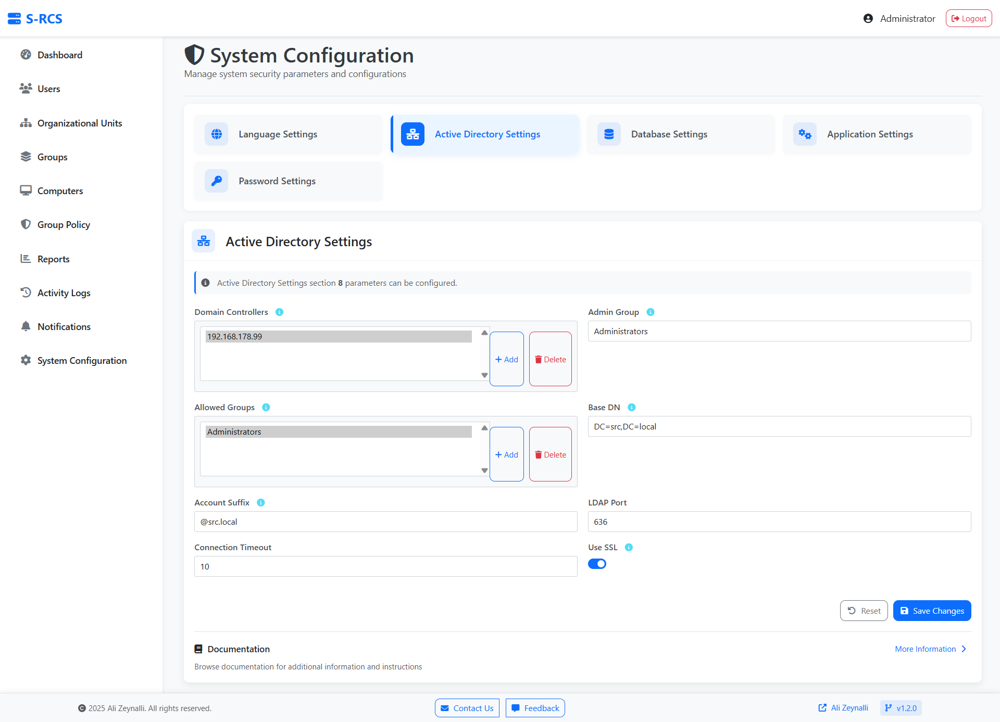 |
| *Detallı sistem tənzimləməsi* | *Mühit parametrləri* | *Təhlükəsizlik və Giriş* |

---

### ⚠️ Lisenziya və İmtina (Disclaimer)

**© 2025 Əli Zeynallı. Bütün Hüquqlar Qorunur.**

**S-RCS (Server Reporting and Controlling System)** yalnız **Əli Zeynallı**-nın əqli mülkiyyətidir.

*   Bu proqram təminatı standart istifadə üçün **PULSUZDUR** və **SATILMIR**.
*   **Lisenziya Haqqı Yoxdur**: Sistemi sərbəst şəkildə yükləyə, quraşdıra və istifadə edə bilərsiniz.
*   **Dəstək Xidmətləri**: Ödəniş yalnız tələb olunduqda **peşəkar quraşdırma dəstəyi** və **təlim sessiyaları** üçün tətbiq olunur.
